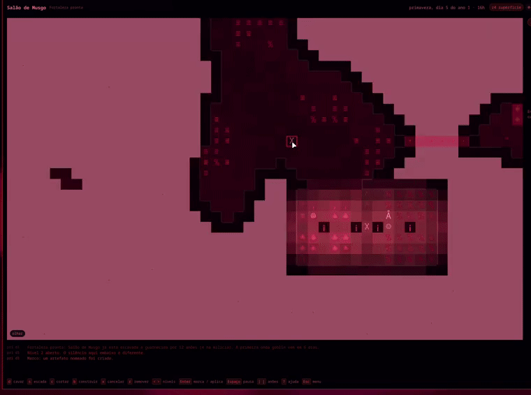

# Omahold

**A miniature dwarven hold that lives inside omarchy-shell.** · by ZeD

*[Leia em português](README.pt-BR.md)*




An Omarchy plugin: a world of 48×30 cells with 8 levels of depth (z-levels),
seven dwarves with hunger, thirst, sleep, mood and trades, digging, farming,
brewing, crafting, strange moods and artifacts, migrants, caravans, goblin
ambushes, wolves in winter, kobold thieves, floods and magma. All of it drawn
in the colors of the active theme — changing the theme dresses the hold in
another climate.

While you work the world ticks slowly (a day of fortress time every few
minutes). When you open the panel it runs at four ticks a second. Nothing is
drawn without a visible surface, and one tick costs a fraction of a
millisecond on a 2014 MacBook.

```
omarchy plugin add https://github.com/zednaked/omahold.git --enable
# or, by hand:
cp -r . ~/.config/omarchy/plugins/zed.omahold && omarchy-shell shell rescanPlugins && omarchy plugin enable zed.omahold
```

**To remove:**

```
omarchy plugin disable zed.omahold
omarchy plugin remove zed.omahold
# or, by hand:
rm -rf ~/.config/omarchy/plugins/zed.omahold
# the saved hold lives outside the plugin folder; to take that too:
rm -rf ~/.local/state/omarchy/omahold
```

The plugin does not write to `shell.json` or to any configuration of yours —
what puts it on the bar is `omarchy plugin enable`, or your own hand.

**Dependencies:** pure QML, no binary and no network, plus `python3` — used
only for disk access (`save.py`), for the security reasons explained in
[Where the hold is written](#where-the-hold-is-written). Omarchy's own scripts
already use `python3`, so this adds nothing to the machine.

**Language:** English and Portuguese, in `≡ menu → Options → Language`. The
first load follows the system's `LANG`; after that your choice is remembered.

## Three surfaces

| Where | What |
|---|---|
| **The bar** | `☺ 7` — population. A dot lights up when something has happened since you last looked (a caravan, a death, an artifact). Click opens the world; right click toggles the corner window; the wheel changes its level. |
| **Corner window** (`m`, or right click on the bar) | A live 240×150 px view in the bottom-right corner, above your windows, without stealing focus. For keeping an eye on it while you do something else. Clicking it opens the panel. |
| **The panel** (`omarchy-shell omahold toggle`, or click the bar) | One level of the map, a sidebar, announcements, and the keys to give orders. |

A suggested binding for `~/.config/hypr/bindings.lua`:

```lua
o.bind("SUPER SHIFT", "F", "omarchy-shell omahold toggle", "Omahold")
```

The chips in the header explain themselves on hover: what `☺ 12 · ⚔ 4` counts,
what `☼` is worth, why `locked` matters. And the Help page (`?`) carries a
legend of every glyph the map draws — `Ω` a statue, `‡` a forge, `†` a grave —
built from the same tables the map uses, so it cannot drift out of date.

## Menu, presets and slots

`Esc` (with nothing to cancel) or the **≡ menu** button opens the menu; `Esc`
in it closes the panel.

- **New game**: seven presets, each one a different part of the game to look at
  first. They differ in more than how many goblins arrive: how much of the hall
  was arranged, how many spikes are in the corridor, whether the hold came
  together as families, and whether the shaft already reaches the deep.

  | preset | dwarves | what it is for |
  |---|---|---|
  | **Classic embark** | 7 | from nothing, as tradition demands |
  | **Ready fortress** | 12 | four levels dug, a hearth, game tables, spikes at the gate; waves every 15 days |
  | **Garrison** | 10 | six in the militia, six traps, no hall to speak of; waves early and often |
  | **Quiet valley** | 12 | no enemies and the whole hall arranged — two hearths, two crystal columns, four game tables. The economy and the moods without blood |
  | **Full house** | 16 | everyone arrived as families, half of them already inseparable. The stories start the night before, and the first loss hurts |
  | **Threshold of the deep** | 12 | the shaft is already cut down to the iron. The last level — 50% to wake something, and the tomb in its rock — is left for you |
  | **Siege** | 8 | big waves from day two with veterans, and spikes the length of the corridor. Nobody expects this to last |

  **Custom** picks the preset, the number of dwarves (4–24) and a numeric seed.
- **Save / Load**: five slots with the name, preset, in-game date, population
  and when it was written; `x` twice clears a slot for reuse. The autosave
  (`world.json`) stays independent of the slots.
- **View / inspect** (`v` in the menu; `o` in game cycles): Normal, **Light**
  (a heat map of the lighting), **Mood** (a halo per dwarf), **Access** (what
  can be walked to from the gate or from where the dwarves are; red = cut
  off). It is the same field that decides which designations come out red on
  the map. "Jump to an hour of the day" shows night and torches without
  waiting.
- **Options** (kept in `options.json`): pace with the panel closed (frozen, 1
  tick every 4 s / 2 s / 1 s, 4 per second), speed with the panel open, blocks
  or glyphs, the corner window, the population cap, enemies on or off, goblin
  waves calm / normal / brutal, and the language.

The same over IPC: `omarchy-shell omahold preset <classic|ready|garrison|peaceful|kinfolk|depths|siege>`,
`saveSlot <n>`, `loadSlot <n>`, `slots`, `presets`.

## Workshop orders (`w`)

What comes out of a workshop comes off a queue, and the queue has two owners.

**The hold writes its own.** Every morning it looks at what it has and notes
what is missing: ale if the cellar is low, meals if there is raw food to
spare, bars if there is ore, a pick if a miner has none, armor for whoever
just joined the militia. If there is a still and there is food, somebody brews
— without being told. That is the minimum autonomy: given the infrastructure
and the material, they produce.

**You write yours** in the menu (`≡ menu → Orders`, or `w` to see the queue).
Your orders take precedence over the hold's — but precedence is not obedience.
Nobody drops what they are doing:

- **Need beats order.** Hunger, thirst and sleep come before any queue. The
  order waits for the dwarf to wake up.
- **Subsistence beats taste.** With an empty larder or a dry cellar nobody
  cuts gems — not the jeweler who loves cutting them, and not because you
  asked.
- **Inclination picks who does it.** Every dwarf has a trade they prefer and
  one they cannot stand (their sheet, on the Dwarves page, shows both).
  Between two orders they could take, they reach for the one they like.
  Measured: 12.6% of their work in the trade they love against 7.5% in the one
  they hate — the aversion weighs more than the preference, because forcing
  the preference cost 28% of the hold's output when it was tried.
- **They get it wrong.** Skill, mood, hunger and taste decide: an apprentice
  ruins one piece in ten, a master almost never. Ruined work eats the material
  and yields nothing. Three in a row and the dwarf **walks away from that
  trade for a day** — their sheet says so. Nobody ruins the hold's last ale:
  whoever handles the reserve is twice as careful.

The Legends page counts how many jobs were ruined. The curve is visible: in a
new hold it is about 140 in the first year and 50 in the fourth, as skill goes
up — and it climbs again when a batch of migrants arrives with no trade.

## Who knows whom

A dwarf had a trait, a trade and a mood, and was alone in the world. Every
loss cost every survivor the same −7 whoever died, so "3 dwarves lost" was
arithmetic and never a story.

Now they have people. Some arrive with **kin** already in the hold — a quarter
of every group, founders included — and **friendships and rivalries** come out
of standing next to the same people: every couple of hours of game time, each
dwarf builds a tie with whoever is nearest, twice as fast in the meeting hall.
A dwarf keeps four ties plus their kin, which is what makes a tie mean
anything: remember everyone and a death is diluted into twenty small sorrows,
remember four and it lands on somebody.

What it changes:

| who died | what it costs them |
|---|---|
| kin | **−16**, and grief that has to be dealt with |
| a friend | **−12**, and grief |
| anyone else | −5 with a grave to go to, −7 without |
| someone they could not stand | −1, and a line in their thoughts about it |

**Grief is not a mood, it is work.** It weighs on them every day until they
have gone and stood among the graves — which is what the graveyard the hold
chose is for. A hold with nowhere to bury anyone carries it for weeks instead.

Friendships pay for themselves: measured over sixteen fortresses, adding ties
took survivors from 14/16 to 15/16, because the +5 of finding a friend and the
+3 of a night drinking with them outweigh the deeper grief.

Kin, friends, rivals and what they are carrying show on a dwarf's own page, and
the chronicle records the day two of them became inseparable, the day two of
them fell out, and every loss that landed on someone.

## Halls worth arranging

A torch lights four cells and that is all it does, so a hall was either lit or
it was not, and there was nothing to arrange. Four things carry an effect
instead, and all four are in the ready hold as a demonstration:

| `key` | | cost | what it does |
|---|---|---|---|
| `h` | **hearth** `Ψ` | a log | lights a whole hall, wavering; wounds mend **twice as fast** within three cells; dwarves drift to it when idle, and hardest at night |
| `y` | **crystal column** `¥` | a cut gem | the same reach, without the flicker — and worth 90 to the hold's wealth. Standing near it is **+5** mood, the best thing to look at in the game |
| `m` | **game table** `Ж` | a log | two dwarves play: **+4** mood each and a tie that grows four times faster than a corridor. One game in eight ends badly and starts a rivalry |
| `x` | **spike trap** `^` | a bar of metal | 3–6 damage to any hostile that steps on it, **three charges**, then it comes apart. Dwarves walk over it safely |

A hearth or a column reaches **more than twice as far as a torch** (16.5
against 6.0 of summed light on the level), so three of them light what a dozen
torches did.

The traps are the first defence you build rather than man — a corridor of
spikes is a real, recurring cost in metal rather than a permanent wall, which
is the answer to a militia of four against a wave of nine.

Measured over sixteen fortresses: **mood 55 → 74**, population 12.1 → 15.6, and
no fortress lost where one was lost before. A tick costs about 6% more per
dwarf.

The one thing that had to be tuned: **a game lasts twelve ticks, not
twenty-four.** A dwarf at the table does not look for work until the game is
over, and at twenty-four the hold dropped to 10.9 dwarves and lost a fortress.
Idleness spent on each other is free; idleness that ignores the larder is not.

## The militia, and where it stands

The militia had no orders. Every guard reacted to whatever came within nine
cells of wherever they happened to be, so the hold's defence was wherever its
soldiers were standing when the wave arrived — and once things started coming
up from the deep, that was almost never the right place.

A **guard post** (`k`, a block of stone) is how you say *hold here*. The squads
sort themselves out: every post gets its share of the militia, nearest first,
and a post left standing when a guard dies is filled by whoever is next. No
post and nothing changes — the militia works and reacts, the way it always did.

A posted guard:

- **takes no work at all**, not even the player's digging. Letting them pick up
  a hauling job meant they held the post a tenth of the time and were across
  the fortress for the rest of it. The labour it costs is the price of the
  order: post six dwarves and the hold is six workers short.
- **does not chase** anything further than twelve cells from the post. Running
  after a wolf six levels up is how the gate ends up empty.
- **trains at a yard near the post**, or not at all.

Measured over a two-day watch: they spend about a third of it standing at the
post, a fifth walking back to it, and the rest eating, drinking and sleeping,
which no order can do anything about.

**What a post costs, over sixteen fortresses:**

| posts | dwarves alive | mood |
|---|---|---|
| none | 13.7 | 75 |
| one | **18.2** | 65 |
| two | 16.6 | 64 |

Four and a half more dwarves alive for ten points of mood — a militarised hold
is a safer one and a glummer one, and the second post buys nothing the first
one did not. That is the decision; the ready fortress ships with one.

One thing had to be fixed to make posts safe at all: `work()` runs before
`needJob()`, so a guard holding a job that never ends never eats or drinks
again. Posting the militia put five deaths of thirst into sixteen fortresses
that had none, and the job now releases on thirst, hunger, sleep or a path that
ran out.

A second post splits the militia in two, and that is the whole squad system:
the gate and the stairwell, or the stairwell and the deep.

## Going down

Descending needs a staircase at **both ends**: one on the level you leave and a
step on the floor you arrive at. `s` on a built staircase means *go one level
deeper*, and it orders whatever is needed on the cell below —

- **rock**: it is cut, and the stair takes the cell over even if a dig was
  already pending there. Drawing the room on the level below before cutting the
  descent is the natural way to play, and refusing it silently left the whole
  level unreachable.
- **an open cavern floor**: the step is *built* on it, by a dwarf working from
  the staircase above. Without this there was no way at all to reach a cavern
  directly under a shaft — the staircase stood over it and went nowhere, and
  `s` refused the order for having nothing to dig.
- **magma or water**: refused, and it says which. Cutting into it floods the
  fortress; level 0 is the magma level, so a shaft usually stops at 1.

Every refusal names its reason in the status line — which one it is matters,
because a level nobody can reach is a level of work that never starts. If four
or more designations end up stranded anyway, the hold says so at dawn and names
the level.

`make stairs` is eighteen checks over exactly this, because every case above
was a player report.

### Dying of thirst, three ways

Every one of these came out of a player report and then a measurement, and none
of them were the dwarves failing to look for water:

- **A wave beats hunger.** `fightOrFlee` runs before `needJob`, so five of the
  eight dwarves who ever reached thirst 125 did it with goblins in the
  fortress, fighting and fleeing for days with a full cellar twenty cells away.
  Past thirst or hunger 115 the need now wins — unless there is a foe within
  arm's reach, because there is no drinking past that.
- **Arriving in a pocket.** `edgeSurface` checks the arrival point has a path
  to the gate, but migrants spread up to two cells off it, and on a wooded edge
  some of those are dead ends. Two migrants in sixteen fortresses landed in one
  and died there. `nearFree` now requires a path to the hold.
- **The scenery closing in.** A regrown tree must not take the last way out of
  the cell beside it, not just of its own cell — the original bug walled three
  dwarves into six cells of grass with 59 drinks they could no longer reach.

Sixteen fortresses now lose **nobody** to thirst in two years, and `make
presets` fails if any preset loses one in its first year or leaves anybody cut
off from the hold.

## Water

Water was scenery with one use: a thirsty dwarf walked to the edge of it and
drank, which is how three of them once died of thirst on the wrong side of a
regrown tree.

A **well** (`n`) is built at the edge of water and drawn from where the hold
lives. It is what keeps everyone alive the season the still runs dry, and
drinking from it costs no mood, where drinking from a puddle costs −2.

A **floodgate** (`z`) is the other half: liquid cannot pass it while it is
shut. Dig a channel, keep it closed, and open it when the corridor is full of
goblins — the oldest trick in this genre, and impossible here until now. All
the gates work as one lever: `Shift+G`, or **≡ menu → Orders → Floodgates**.
Open shows as a warning on the Here page, because open is not the safe state.

Every ready hold builds its own **cistern** for this — the rock beside the
stores, cut and filled, with the well drawing from one side and the gate
holding the other. Which means the lever in a fresh fortress floods its own
hall. That is a fair warning about what the lever is for.

## Artifacts are about something

An artifact was a name and a sentence from a table — *"it bears an image of
cheese"* — charming once, and then plainly disconnected from the fortress it
came out of. The one legendary object a hold would ever make said nothing about
the hold.

A strange mood now **starts from something that happened**, and the thing they
make records it. Their own dead weigh most, because that is what the dwarf has
been turning over; then the living they have feelings about; then what the hold
as a whole has been through — a wave that broke on the gate, a siege, the tomb,
the relic, a pact or a grudge with the deep, the baron, the caravans, the
graves, the magma, and the artifact somebody made before this one. The founding
is always available, so there is never nothing to carve.

Half the time the title takes the house name of whoever it is about, and the
scene says what it shows:

```
"the Crown of idsenursen"  — it depicts idsenursen, made before it in this same fortress
"the Root of Stoneold"     — it bears an image of Udib and of the maker, side by side. It is a farewell
"the Moon of Storms"       — it depicts level 2 and the thing that woke in it
```

The inspiration is decided when the mood strikes, not when the work finishes,
so the object is about the thing that set them off even if the fortress has
moved on by the time it is done. It is kept on the artifact and survives the
save, and a dwarf's own artifacts are listed by name on their Lives page —
the chronicle records that an artifact was made, but not that this is the dwarf
who made it.

Every ready hold starts with one **heirloom**, made about what that preset is
about: the founding for most, a relative for a hold of families, the deep for
one that has already dug to it. A classic embark starts with no history, which
is the point of a classic embark.

## The caravan, and the deal

The caravan was the one friendly visitor in the game and it was an automaton:
it took up to four things it picked itself and left food in a fixed ratio, so
crafts and jewels were worth only the wealth they added.

Now it is a deal with two sides. **≡ menu → Orders → Caravan** puts your goods
on the table and names what you want back; they weigh both at their own prices
and take it if what they give is worth no more than **four fifths** of what
they take. Dwarves then carry the offer to the camp like any other hauling job,
and **nothing moves until the whole offer has arrived** — which is what makes it
a decision rather than a button. They leave on the fifth day and pay for
whatever got there in time.

**If you say nothing, the hold trades for itself.** Same principle as the
morning work orders: it sells what is piling up above a floor and asks for what
is running out — food under 60% of the larder cap, drink, logs, bars, a pick —
and scales the ask back until the merchants would take it. The moment you touch
the table it is yours, including clearing it to nothing on purpose.

## The king comes up

The lost king was a name in the envoy's sentence: *"in the name of king
so-and-so"*. A hold that pays its tribute is a hold worth visiting, so
twenty-five days later he climbs out of the deep himself, with two of his
guard, and stays six days. While he is in the hall everyone talks about it.

What he makes of the visit depends on what he finds:

- a hold that **grew** since the tribute gets a named weapon from his own
  smith — grade 4, above steel, below the tomb's relic;
- one that **held its ground** gets his word, and the protection of his people;
- one that **fell apart** gets a look, and they feel it.

## Wounds

A wound was a number that went back up on its own, so being hurt cost time and
nothing else. Below **a third** of their hit points a dwarf is *wounded*: they
work at half speed, and they do not heal at all on their own.

They need an **infirmary bed** (`i`) to lie in and somebody to tend them — any
dwarf will do, faster if they have the hands for it. Tending mends 3 or more
hit points and builds a tie between the two of them, because being looked after
is not nothing. The Here page names whoever is down, and says if there is
nowhere to put them.

Left alone a bad wound closes at **four days a hit point**, which is slow
enough that an infirmary is worth building and not so slow that a hold without
one is condemned. Not healing at all was tried first and cost two dwarves a
fortress: the classic embark never has a bed.

## Animals

A **pen** (`a`) is the cheapest way to have something in the fortress that is
nobody's job. The caravan brings livestock to a hold that has somewhere to put
them: goats, which stand on grass or moss and give the kitchen something that
is not the farm, and cats, which wander off, turn up beside whoever is standing
still, and get themselves adopted.

Every animal has a name. When one dies the hold notices, and whoever kept it
grieves — the grief system was already there, and an animal is the cheapest
thing in this game that can be loved.

### A standing job gives way to a need

`work()` runs before `needJob()`, so a job that only ends on its own terms is a
dwarf who stops eating. This has now bitten three times — a guard holding an
unreachable post, a wounded dwarf lying in an infirmary bed with the cellar
four steps away, and a militia dwarf at 2 hit points out of 12 who drilled for
561 ticks because the guard-post shortcut runs before the branch that puts the
hurt to bed.

So it is a rule rather than three fixes. Every open-ended job has the thirst or
hunger that interrupts it:

| job | interrupted at |
|---|---|
| lying wounded, holding a post, tending | 65 — the ordinary threshold |
| drilling | 80 |
| a game, standing at a grave | 95 |

The split matters: a game takes twelve ticks and a grave twenty, and
interrupting those at 65 threw the whole point of them away — five points of
mood across sixteen fortresses. And an infirmary bed counts as a bed, so sleep
does not get a wounded dwarf out of one; without that they left to sleep
elsewhere and nobody could tend them, because tending needs the patient
actually lying there.

## The capital

"Legendary" used to be the end: six milestones, a scoreboard, and then the
fortress kept running with nothing left to reach for. A hold that has done
everything is not finished, it is **promoted**.

The Mountainhomes recognise it as a **capital** and send the crown. The baron is
raised to king and the barony falls vacant; the population cap goes up by eight,
because everyone wants to live where the king lives; and everyone gets **+10**
mood for living somewhere that matters. If the king dies, the hold crowns
another — the only succession in the game.

And the goblins start treating it as what it is. **Forty-eight days after the
crown**, announced twenty days ahead, they come for it with everything at once:
the royal siege. Holding that is the last thing this game asks of you.

## Lives

The Legends page has everything that ever happened, in order. That is a record,
not a story — the story is what happened to somebody.

The **Lives** page (`Tab` to it, `↑ ↓` to browse) is one dwarf at a time: their
trade and trait, their kin, friends and rivals, what they have killed and made,
how long they have been here, the relic they carry — and then the chronicle,
filtered to the lines with their name in them. The dead are on the same list,
after the living, with how and when; their lines outlive them, which is the
point of keeping a chronicle at all.

Two years of "Full house" leaves 24 of 26 lives with something written about
them. A typical one reads:

```
Doish Musgoseca e Kibeth Ferrovelha tornaram-se inseparáveis no ano 1.
Doish Musgoseca e Riist Pedrafunda tornaram-se inseparáveis no ano 1.
Doish Musgoseca perdeu o amigo Riist Pedrafunda no ano 1.
Doish Musgoseca perdeu Udib Rochavelha, do seu próprio sangue, no ano 1.
```

## The dead

Whoever falls stays where they fell, and every dwarf who walks past feels it.
They sort this out themselves: they choose a **graveyard** — a corner they can
walk to, away from the beds, the tables and the workshops, because that is
what makes a place a quiet one — and start carrying their companions there.
Each burial leaves a `†` on the map.

- Walking past the remains of someone with no grave: **−4** mood (−6 for a
  melancholic).
- Burying a companion as one should: **+3** for whoever carries them.
- With a graveyard open the loss weighs less on everyone: **−5** instead of
  **−7**, because they know where that one is going.

Nobody picks the place for you, and you do not have to designate anything. But
if the hold has no quiet reachable corner — everything occupied, or the only
isolated space with no stairs — the dead stay on the floor and it shows in
everyone's mood. The Legends page counts how many were buried.

## What the hold knows

The map used to show everything. The caverns, the gem seams and the ore veins
were all on screen before a single pick touched them, so digging was never
exploration — you already knew where to go, and the only question was whether
it was worth the walk.

Now unexplored rock is drawn as unexplored. A cell becomes known when it is
dug, when it is beside something dug (the wall you can see from inside a
corridor), and when a dwarf walks near it. Three things are known from the
start, because hiding them would be fog for its own sake: **everything at or
above the natural ground** (you can see the sky and the hillside you embarked
on), **everything the hold can already walk to**, and the walls beside it. A
ready hold knows its own rooms.

At embark that leaves 11% of the underground known, and **no gem seam, no vein
and no cavern moss on screen at all**.

Breaking into an open space shows you the space. A pick that comes through the
wall of a cavern reveals the cavern — the floor you can see across and the
walls around it — rather than one square with a staircase in it. It is capped
at 240 cells, because a cavern can run the width of the map and a dwarf
standing at one end cannot see the other; a chamber you dug yourself is always
well inside that.

**A hunch.** Your dwarves can tell there is *something* past the wall in front
of them — not what it is. A `·` on an unexplored cell means they feel
something one cell further in: a seam, a vein, or an open cavern. It is asked
only of walls that face somewhere known, so a hunch is always about rock
somebody could put a pick to.

They are wrong on purpose. Measured over four seeds: of the walls with
something behind them they feel **75%**, and of the hunches they have **16%
have nothing behind them at all**. A hunch that is never wrong is just the map
with extra steps. The same mark is used for a gem seam and for a cavern,
because that is genuinely all they know.

The feeling does not flicker: it is decided by the cell, not by the dice, so
the same wall gives the same hunch until it is dug.

**`≡ menu → Options → Unexplored rock`** turns the whole thing off and shows
the map complete, seams and all, for anyone who would rather plan than
discover.

## What sleeps below

Digging down used to only ever pay. Copper became iron became steel, the gems
got better, and the magma milestone waited at the bottom; the worst that could
happen was a dwarf walking into the magma. The deepest level a hold had reached
said nothing about its risk — greed had no price.

Now every level your picks open at or below the third can wake something that
has been asleep since before the hold, and the chance grows with the depth:

| level | chance something stirs | what is down there |
|---|---|---|
| 3 | 10% | copper, and almost certainly nothing else |
| 2 | 25% | iron |
| 1 | 50% | the caverns, and a **lost race** — crawlers, which come in numbers |
| 0 | 85% | steel, and a **sentinel of the deep**, of which one is enough |

**What wakes comes up from that level, not from the gate.** Locked doors and a
militia posted at the entrance buy nothing against it: the hold is breached
from underneath. And what came up from the deep has nowhere to go home to, so
it does not give up and walk off the edge the way a raiding party does.

Each new waking sends more than the last, because a hold that keeps digging
keeps paying.

The deepest rock sometimes gives up a **tomb**: an artifact older than the
hold, named after the lost king buried with it. It never comes alone, because
something was keeping it — and what is keeping it is holding **the one weapon
in the game nobody can make**. It has a name, it is one grade above steel, and
it does not wear out. Killing the guard is the only way it changes hands; when
its bearer dies it keeps its name and lies there waiting for whoever picks it
up next. Militia dwarves reach for the best weapon in the hold rather than the
nearest one, so a relic on the floor does not sit there.

That is what depth is for. Every other reward down there is a better grade of
something you were already making; this one exists once.

## The lost court

Everything that came up from the deep wanted the hold dead, which made depth a
monster with better loot behind it. Something else lives down there: a people
who did not die out, ruled by a king nobody up here has heard of in centuries.
When a shaft breaks into one of the bottom two levels and *nothing wakes*,
there is a good chance they send someone up to talk instead.

The **envoy** is not a foe and cannot be fought into anything useful. They walk
to the depot, ask for **tribute** — real goods, taken out of your stockpiles,
counted above what you already have — and wait fifteen days.

Pay them and they give back something the hold cannot make:

- a **pact**, and nothing wakes in the deep again;
- **steel from their own forges**, three bars and a cut gem;
- the **map of their level**, which is the only way the fog comes off ground no
  dwarf has walked.

Refuse them and the envoy goes back down empty-handed. They do not forget:
everything in the deep wakes at **twice** the chance from then on, and
something comes up in the envoy's place that same day.

This is the one pressure in the game you create entirely by digging.

Measured: a hold that stays at its mine level pays nothing, and one that digs
to the magma lost two fortresses in five. The `⚷` chip in the header shows how
deep the picks have gone, and turns red once something is awake down there.

## The baron

A hold worth 4000 draws a noble. It is one of your own dwarves, promoted — the
one with the most skill — and if they die the hold names another, which is the
only promotion in the game.

The baron **wants things**: another statue to look at, jewels in the treasury,
a fuller cellar, a drill yard, torches in the halls, prepared meals in the
larder. Each demand is counted from what the hold already had when it was
made, so "another statue" rather than "a statue" — a baron satisfied by what
you already own is not pressure. There is a season to meet it.

- Met: **+4** mood for everyone. A hold that satisfies its baron is a hold
  doing well, and it knows it.
- Unanswered after twenty days: **−3** for everyone, and the Legends page
  records it.

Some demands the hold meets on its own (the kitchen keeps making meals); others
need you to build something. The baron and the open demand show on the Here
page, with the days left.

## Milestones, and winning

There are six things a hold does on its way up, each announced when it happens
and dated in the Legends page:

| milestone | what it takes |
|---|---|
| an artifact | a strange mood runs its course and names something |
| 6000 in worth | everything the hold owns and has built |
| eighteen dwarves | migrants come by wealth, and they need beds and food to stay |
| three attacks repelled | the militia holds three times |
| reach the magma | somebody digs a shaft all the way to level 0 |
| five years standing | the hold is still there |

Doing all six makes the hold **legendary**, which is this game's version of
winning: the world keeps going (there is no screen to stop at), but the date
is recorded and the reckoning is written then rather than only when everyone
is dead. A fallen hold gets the same reckoning, which is what a ruin deserves
instead of a last death notice.

Measured over eight seeds and six years with nobody touching anything: the
artifact and the three attacks land 8 times out of 8, eighteen dwarves 6, the
worth 5, five years 3 — and **the magma 0, legendary 0**. Five of the six come
with a healthy hold; the one that closes the game asks you to dig where it is
dangerous.

## Metal grades

The deeper the ore, the better the metal: **copper** in the shallow levels,
**iron** below them, **steel** in the last level before the magma. A bar keeps
the grade of the ore it was smelted from, gear keeps the grade of the bar, and
better gear hits harder and absorbs more — so the shaft that earns the magma
milestone is also what lets a hold meet the ninth wave in something better
than copper. Arms and armor are always forged from the best bar in the hold,
not the nearest one.

## Siege

Goblins who cannot get through the door used to give up after a day, and the
wave counted as repelled having cost nothing: locking the doors (`L`) was a
free win. Now they sit outside for up to eight days, and while there are
goblins alive on the surface with none of them inside, the hold is **under
siege** — nobody works above ground, which takes the surface fields, the shrub
gathering and the woodcutting with it.

Four seeds over two years, with and without locking:

| | repelled | deaths | pop | days besieged |
|---|---|---|---|---|
| doors open | 11.0 | 13.0 | 13.8 | 2.0 |
| doors locked | 10.5 | 14.5 | 9.8 | 21.2 |

Deaths go **up** when you lock, which is the point: nobody is lost to a goblin
and the bill arrives as privation instead. The decision has two sides now.

## How it is played

It is Dwarf Fortress in miniature: you do not control dwarves, you
**designate** what you want done and they decide who does it.

1. Mark **stairs** (`s`) at the wagon: on a floor, that already marks the
   descent (the cell and the rock below it). To go deeper, go down (`>`) and
   press `s` again over the stairs. Stairs marked in rock are dug from any
   floor that exists above them.
2. **Dig** (`d`) a hall: Enter marks a corner, Enter again applies; or drag
   with the mouse.
3. **Build** (`b`): beds (`b b`), tables (`b t`), a still (`b d`), a workshop
   (`b o`), a stockpile (`b e`). Beds and tables consume logs (fell trees with
   `c`); the still and the workshop consume stone (which comes from digging).
4. **Plant** (`b f`) on soil, grass or cave moss. A stone floor will not do.
   Once there is ore, a **smelter** (`b u`) and a **forge** (`b j`) turn it
   into picks, axes, weapons and armor; **torches** (`b l`) light the halls; a
   **drill yard** (`b r`) gives the militia somewhere to train.
5. Designations **in red** have no path to them for now (missing stairs, or
   access on the same level); the Here page explains. They are retried on
   their own.
6. Watch. Dwarves eat, drink mushroom ale (or water, and complain), sleep in a
   bed or on the floor, talk at the tables, grieve when someone dies. A mood
   low enough becomes a tantrum; a tantrum witnessed lowers everyone else's
   mood. That is how a hold falls.

Take care: digging under the stream **floods**; digging to level 0 finds
**magma**; the caverns (level 1) have moss, giant mushrooms and water.

Key hints live in the footer; the active tool shows in a pill over the map and
warnings in a toast at the center.

### Keys

| | |
|---|---|
| arrows / `hjkl` | move the cursor (`Shift`: 5 cells) |
| `<` `>` `,` `.` PgUp/PgDn, wheel | up / down one level |
| `Enter` | mark a corner; again applies. In look mode: selects what is under the cursor |
| mouse | drag applies the tool; right click selects |
| `d` `s` `c` | dig, stairs (on a floor: digs the descent; over stairs: keeps going down), chop |
| `b` + letter | build: `b` bed `t` table `f` plot `e` stockpile `p` door `w` wall `l` torch `o` workshop `d` still `c` kitchen `u` smelter `j` forge `g` jeweler `r` drill yard `s` statue |
| `x` `r` | cancel a designation, remove a building |
| `]` `[` `f` | next/previous dwarf; follow the selected one |
| `Space` `+` `-` | pause; speed 1×/2×/4× |
| `L` | lock the doors: goblins, wolves and kobolds cannot pass |
| `g` | blocks ↔ glyphs (the classic look) |
| `m` | corner window |
| `Tab` `u` `i` `w` `y` `?` | pages: Dwarves, Here, **Orders**, Legends, Help |
| `Home` | back to the wagon |
| `n` | New game menu |
| `Shift+S` | Save menu |
| `Esc` | leave the tool / menu |

## The showcase scenario

`omarchy-shell omahold scenario 12` (or **New game → Ready hold** in the menu,
`n`) swaps the world for a finished hold, built to watch every loop run and to
measure how much it can take:

| Level | What is there |
|---|---|
| surface | a walled gate with a door south of the stairs |
| −1 | 12 plots, a larder with 40 food, 12 meals and 40 drinks, torches |
| −2 | a dining hall with 12 tables, a kitchen, two stills, statues, torches |
| −3 | a dormitory (beds for everyone and four more), a smelter, a forge, two workshops, two drill yards, a stockpile with logs, stone, ore, bars and spare gear |
| mines | galleries with every vein in reach already designated, with access tunnels |

The dwarves arrive with trades: miners with picks, woodcutters with axes,
farmers, a brewer, a smith, a mason. A third of them form the **militia**,
already armed and armored, and drill in the yard when there is nothing else to
do.

The full loop: fields → food → a meal (kitchen) and ale (still); tree → log →
bed/table/door/torch; digging → stone → buildings and crafts; ore →
**smelter** → bar → **forge** → pick, axe, weapon, armor (by need: whoever has
none first); rough gem (mined from `☼` in the rock) → **jeweler** → cut gem →
jewel, the most valuable goods for the caravan. **Light** is simulated per
cell: the sun rises and sets (long days in summer, short in winter, weaker in
the rain), each torch **flickers** and throws warm light that fades with
distance and **does not cross rock or wall** (nor turn a corner), and magma
glows red. Only the face of a wall that touches open floor takes light; rock
and wall are drawn as masonry with a bright line on the edge facing the floor,
so the outline of a room is crisp and it is obvious where the solid is. The
surface darkens at night to a bluish moonlight, with tinted dawn and dusk; the
underground stays dim where there is no torch. Sleeping and eating in the dark
are worth less; the Here page shows light as a percentage at the cursor. When
the ore runs out the hold prospects the nearest vein on its own — the whole
vein, with an access tunnel — and when logs run low it marks trees.

None of it piles up forever: the larder holds about ten food per dwarf and
what goes beyond that **rots** (a prepared meal does not, which is why the
kitchen is worth the stone it costs), and **pick, axe, weapon and armor wear
out** until they break. A broken pick is a reason to go back to the mine, and
it is what keeps the smelter and the forge lit in the third year instead of
leaving them ornamental. The Legends page counts what spoiled and what broke.

The **first goblin wave arrives in six days** and then every fifteen, each one
larger (4, 5, 6, 7… up to nine, veterans from the fifth). The scoreboard is on
the Legends page: waves, repelled, goblins killed, dwarves lost. The gear of
whoever falls stays on the floor for the next one. Over two years of testing
with no intervention, across eight seeds (`node test/scenario.js <seed> 2`),
12 dwarves repel the 11 waves, lose about 9 and end with about 16 — migrants
replace more than the goblins take. Locking the doors (`L`) changes
everything: goblins cannot pass and go home.

Waves also answer the **result** of the last one: repelling an attack without
losing anybody sends a bigger one next time, and losing two or more dwarves
takes the pressure back off, up to two goblins either way and never past the
preset's own cap. Sizing the wave by how well defended the hold *looks* was
the other reading of this, and it is the wrong one — it punishes preparation,
so the militia you drilled and the doors you hung would buy nothing. Answering
the outcome is legible from the inside: you won easily, so more came.

If the last dwarf dies anyway, the hold **falls**: the panel marks it, the
Legends page records the end, and the world stops sending waves, caravans and
migrants. Losing is fun, but a ruin should not keep announcing victories.

`omarchy-shell omahold raid` brings a wave now.

## IPC

```
omarchy-shell omahold toggle|open|close|peek|pause|save|status
omarchy-shell omahold speed 1|2|4
omarchy-shell omahold scenario 12         # a ready hold with N dwarves and goblin waves
omarchy-shell omahold raid                # a wave now
omarchy-shell omahold hour 22             # jump to an hour of the day (0-24)
omarchy-shell omahold view light          # normal | light | mood | access
omarchy-shell omahold background 2000     # ms per tick with the panel closed; 0 freezes
omarchy-shell omahold newWorld ""         # or a numeric seed
```

Inline options on the widget entry in `~/.config/omarchy/shell.json`:
`{ "id": "zed.omahold", "backgroundMs": 2000, "popCap": 20, "peek": false }`.

## Where the hold is written

The world lives in `~/.local/state/omarchy/omahold/world.json`, saved every
90 s and when the panel closes; it survives shell restarts. The five slots,
their index and the options sit in the same directory, mode 700, each file
600.

All of it goes through one place: `save.py`, always invoked as
`/usr/bin/python3 -I save.py <mode> <paths relative to $HOME>`, with a closed
environment and no execute bit. It used to be three different ways in —
`sh -c 'cat …'` to read, `FileView` to write and `rm -f` to clear a slot — and
none of them could check the file it was about to touch and then touch that
same file. That is what the marketplace security review blocked
[omarchy-ganja](https://github.com/zednaked/omarchy-ganja) for twice: in shell
every command resolves the path again, so a check and a use are two
resolutions and what was checked can be exchanged in between.

The helper descends from `$HOME` component by component with `openat` +
`O_NOFOLLOW`, validates each directory on the descriptor itself, and holds
that descriptor through the read, the write, the `fsync` and the `renameat`.
It refuses anything that is not a regular file of yours with a single link,
caps at 1 MiB with a five-second deadline, and can only ever name the plugin's
own seven files. `python3 test/hostile.py` runs the hostile cases in a
throwaway `$HOME` — FIFO, symlink mid-path, hardlink, a 2 MiB save, a planted
temporary, a name outside the list: 40 checks.

## What is simulated, and what is not

**It is**: the ore → bar → tools/weapons/armor chain, cooking, torches and
light, an automatic militia with drills, armor in combat, the showcase
scenario with waves; an economy with drains — raw food rots past the larder's
capacity (prepared meals keep) and pick, axe, weapon and armor wear out with
use until they break, so the mine and the forge have a reason to keep running
after the first year; an order queue the hold writes itself and the player
adds to; dwarves with an inclination and an aversion per trade, who ruin work,
get frustrated and walk away from the bench for a day; a graveyard the dwarves
choose themselves, burial of the dead and the weight of leaving them unburied;
terrain with slopes (implicit ramps), soil/rock/ore/gems, a stream, caverns, a
magma sea; A* in 3D with stairs and slopes; seven needs and trades;
designations for digging, stairs, chopping and building; farming with growth,
a still, a workshop (crafts and weapons from ore), stockpiles and hauling;
claimed beds, meals at a table; thoughts with weight and mood with drift,
tantrums, melancholy (and recovery), murderous rage; strange moods that claim
a workshop, demand a material and produce a named artifact; migrants by wealth
and a population cap; an autumn caravan that buys crafts and gems and leaves
supplies; ambushes scaled by wealth; wolves in winter; kobolds; combat with
skill and weapons; lockable doors; liquids that advance through gaps on a
finite budget; day and night, rain and snow; a chronicle and a memorial.

**It is not** (on purpose, at this scale): real hydraulics (water levels and
pressure), cave-ins, temperature, trading with haggling, nobles, domestic
animals, external sites, and Dwarf Fortress's labor screen — nobody is
assigned to be a baker: each dwarf has a trade they prefer and one they cannot
stand, and they sort themselves out. Each dwarf is a single glyph with no
limbs — a wound is just a number.

## References

This is a "DF-like" in the sense of
[Dwarf Fortress](https://en.wikipedia.org/wiki/Dwarf_Fortress): a world in
vertical slices, indirect orders, characters with emergent stories, and the
rule that losing is fun. Similar things at a smaller scale that served as
comparison: [DeepForge](https://minitech.itch.io/deep-forge) (an ASCII colony
with seven dwarves), [Albert's ASCII Dwarfs Simulation](https://albertfreeman.itch.io/alberts-dwarfs-simulation)
(simulation only, no game), [Undholm](https://store.steampowered.com/app/982060/Undholm/).
The idea of a world running in the corner of the screen while you work comes
from [Taskbar Colony](https://store.steampowered.com/app/5056060) and
[Desktop Colony](https://store.steampowered.com/app/3825610); the idea of a
plugin that lives at the bottom of the shell, from Omalava and
[Omaland](https://github.com/bobby-nicholas/omaland) for omarchy-shell. The
[Omarchy plugin catalog](https://plugins.omarchy.org/) had no game or
simulation when this was written.

## Development

```
make test      everything below
make sim       the simulation, headless
make i18n      both languages, the fallback, and key parity
make deep      the relic from the tomb and the court of the deep
make halls     the hearth, the crystal column, the game table and the traps
make presets   every preset built, checked against its blurb and played a year
make surfaces  what the panel and the corner window have to agree on
make lives     the chronicle read back as one dwarf's biography
make artifacts what a strange mood is about, and what it puts on the object
make stairs    going down, which has broken three times
make trade     the caravan, and the deal the player builds with it
make court     the infirmary, the pen and the crown
make hostile   what save.py refuses, in a throwaway $HOME
make validate  omarchy plugin validate .
```

`sim.js` is plain JavaScript, no QML: `node test/run.js [seed] [years]` plays a
scripted hold and prints the chronicle, the statistics and ASCII maps of three
levels. `node test/scenario.js [seed] [years] [dwarves]` runs the ready hold
and prints the wave scoreboard — it is what the balance figures above are
measured with. `test/relic.js` and `test/court.js` drive the two things at the
bottom of the world that a normal run almost never reaches — a tomb is a 2%
roll per cell dug at level 1 — and check the whole chain each one hangs off.
`test/debug.js` and `test/debug2.js` trace paths and job
transitions — that is how it was found that dwarves were dying of thirst
because `step()` confused "still walking" with "blocked".

Measure across twelve seeds or more, never one: any new `chance()` shifts how
the RNG is consumed and changes the whole trajectory, so a single seed will
tell you a mechanism did something when it did nothing at all.

Files: `manifest.json` · `World.qml` (singleton: the clock, saving, the
palette, the language) · `sim.js` (the world) · `I18n.js` (every word, in both
languages) · `save.py` (the only thing that touches the disk) · `palette.js`
(theme → map colors) · `Fort.qml` (the panel) · `Service.qml` (the corner
window) · `BarWidget.qml`.
