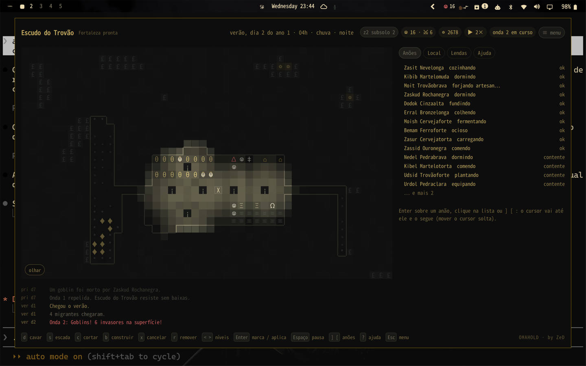

# Omahold

**Uma fortaleza anã miniatura que mora dentro do omarchy-shell.** · by ZeD

*[Read this in English](README.md)*



Um plugin do Omarchy: um mundo de 48×30 células com 8 níveis de profundidade
(z-levels), sete anões com fome, sede, sono, humor e ofícios, escavação,
lavoura, cervejaria, artesanato, humores estranhos e artefatos, migrantes,
caravanas, emboscadas de goblins, lobos no inverno, kobolds ladrões,
inundações e magma. Tudo desenhado com as cores do tema ativo — trocar o
tema veste a fortaleza de outro clima.

Enquanto você trabalha, o mundo anda devagar (um dia de fortaleza a cada
poucos minutos). Quando você abre o painel, corre a quatro ticks por segundo.
Nada é desenhado sem uma janela visível, e um tick custa uma fração de
milissegundo num MacBook de 2014.

```
omarchy plugin add https://github.com/zednaked/omahold.git --enable
# ou, à mão:
cp -r . ~/.config/omarchy/plugins/zed.omahold && omarchy-shell shell rescanPlugins && omarchy plugin enable zed.omahold
```

**Para remover:**

```
omarchy plugin disable zed.omahold
omarchy plugin remove zed.omahold
# ou, à mão:
rm -rf ~/.config/omarchy/plugins/zed.omahold
# a fortaleza salva fica fora da pasta do plugin; para levá-la também:
rm -rf ~/.local/state/omarchy/omahold
```

O plugin não escreve em `shell.json` nem em nenhuma configuração sua — quem o
coloca na barra é o `omarchy plugin enable` ou a sua mão.

**Dependências:** QML puro, sem binário e sem rede, mais `python3` — usado só
para o acesso ao disco (`save.py`), pelas razões de segurança explicadas em
[Onde a fortaleza é gravada](#onde-a-fortaleza-é-gravada). Os próprios scripts
do Omarchy já usam `python3`, então isto não acrescenta nada à máquina.

## Três superfícies

| Onde | O quê |
|---|---|
| **Barra** | `☺ 7` — população. Um ponto acende quando algo aconteceu desde a última olhada (caravana, morte, artefato). Clique abre o mundo; botão direito liga a janelinha de canto; roda muda o nível dela. |
| **Janelinha de canto** (`m` ou botão direito na barra) | Uma vista viva de 240×150 px no canto inferior direito, por cima das janelas, sem roubar foco. Para ficar de olho enquanto faz outra coisa. Clique nela abre o painel. |
| **Painel** (`omarchy-shell omahold toggle`, ou clique na barra) | Mapa de um nível, barra lateral, anúncios e as teclas para dar ordens. |

Sugestão de atalho no `~/.config/hypr/bindings.lua`:

```lua
o.bind("SUPER SHIFT", "F", "omarchy-shell omahold toggle", "Omahold")
```

As pílulas do cabeçalho se explicam ao passar o mouse: o que `☺ 12 · ⚔ 4`
conta, quanto vale o `☼`, por que `trancado` importa. E a página Ajuda (`?`)
traz uma legenda de cada glifo que o mapa desenha — `Ω` estátua, `‡` forja,
`†` túmulo — gerada das mesmas tabelas que o mapa usa, então não sai de data.

## Menu, predefinições e slots

`Esc` (com nada para cancelar) ou o botão **≡ menu** abre o menu; `Esc` nele
fecha o painel.

- **Novo jogo**: Embarque clássico (7 anões, do zero), Fortaleza pronta (12,
  ondas a cada 15 dias), Guarnição (10, seis na milícia, ondas cedo e
  frequentes), Vale tranquilo (fortaleza pronta, sem inimigos), Cerco (8,
  ondas grandes desde o dia 2). **Personalizado** escolhe predefinição, número
  de anões (4–24) e semente numérica.
- **Salvar / Carregar**: cinco slots com nome, predefinição, data do jogo,
  população e quando foi gravado; `x` duas vezes limpa um slot para reuso. O
  autosave (`world.json`) continua independente dos slots.
- **Ver / inspecionar** (`v` no menu; `o` no jogo alterna): Normal, **Luz**
  (mapa de calor da iluminação), **Humor** (halo por anão), **Acesso** (o que
  se alcança a pé desde o portão ou de onde os anões estão; vermelho = isolado).
  É o mesmo campo que decide quais designações saem em vermelho no mapa. "Pular para uma hora do
  dia" mostra noite e tochas sem esperar.
- **Opções** (persistem em `options.json`): ritmo com o painel fechado
  (congelado, 1 tick a cada 4 s / 2 s / 1 s, 4 por segundo), velocidade com o
  painel aberto, blocos ou glifos, janelinha de canto, teto de população,
  inimigos ligados ou não, ondas goblin calmas / normais / brutais.

IPC equivalente: `omarchy-shell omahold preset <classic|ready|garrison|peaceful|siege>`,
`saveSlot <n>`, `loadSlot <n>`, `slots`, `presets`.

## Ordens de oficina (`w`)

O que sai de uma oficina vem de uma fila, e a fila tem dois donos.

**A fortaleza escreve a sua.** Quatro vezes por dia ela olha o que tem e anota
o que falta: cerveja se a adega está baixa, refeições se há comida crua
sobrando, barras se há minério, uma picareta se um mineiro está sem, armadura
para quem entrou na milícia. Se existe destilaria e existe comida, alguém
fermenta — sem você mandar. É a autonomia mínima: havendo infraestrutura e
material, eles produzem.

**Você escreve a sua** no menu (`≡ menu → Ordens`, ou `w` para ver a fila).
Suas ordens têm precedência sobre as da fortaleza — mas precedência não é
obediência. Ninguém larga o que está fazendo:

- **Necessidade vence ordem.** Fome, sede e sono vêm antes de qualquer fila. A
  ordem espera o anão acordar.
- **Subsistência vence gosto.** Com a despensa vazia ou a adega seca, ninguém
  lapida gema — nem o joalheiro que adora lapidar, nem porque você pediu.
- **Inclinação escolhe quem faz.** Cada anão tem um ofício que prefere e um que
  detesta (a ficha dele, na página Anões, mostra os dois). Entre duas ordens
  que ele poderia pegar, vai na que gosta. Medido: 12,6% do trabalho no ofício
  preferido contra 7,5% no detestado — a aversão pesa mais que a preferência,
  porque forçar a preferência custou 28% da produção da fortaleza quando foi
  testado.
- **Eles erram.** Perícia, humor, fome e gosto decidem: um aprendiz estraga uma
  peça em cada dez, um mestre quase nunca. Trabalho estragado consome o
  material e não rende nada. Três seguidos e o anão **larga aquele ofício por
  um dia** — a ficha dele diz isso. Ninguém estraga a última cerveja da
  fortaleza: quem mexe na reserva tem cuidado redobrado.

As Lendas contam quantas tarefas foram estragadas. A curva é visível: numa
fortaleza nova são umas 140 no primeiro ano e 50 no quarto, conforme a perícia
sobe — e volta a subir quando chega uma leva de migrantes sem ofício.

## Quem conhece quem

Um anão tinha um traço, um ofício e um humor, e estava sozinho no mundo. Cada
perda custava a mesma coisa a todos os sobreviventes, −7, quem quer que
morresse — então "3 anões perdidos" era aritmética e nunca história.

Agora eles têm gente. Alguns chegam com **parentes** já na fortaleza — um
quarto de cada grupo, fundadores incluídos — e **amizades e rivalidades**
nascem de ficar ao lado das mesmas pessoas: a cada duas horas de jogo, cada
anão constrói um vínculo com quem estiver mais perto, duas vezes mais rápido no
salão de refeições. Um anão guarda quatro vínculos mais os parentes, e é isso
que faz um vínculo significar algo: lembrar de todos dilui a morte em vinte
tristezas pequenas, lembrar de quatro faz ela cair em alguém.

O que muda:

| quem morreu | quanto custa |
|---|---|
| parente | **−16**, e um luto que precisa ser resolvido |
| um amigo | **−12**, e luto |
| qualquer outro | −5 com um túmulo para visitar, −7 sem |
| alguém que não suportava | −1, e uma linha nos pensamentos sobre isso |

**O luto não é humor, é trabalho.** Pesa todo dia até eles irem ficar um tempo
junto aos túmulos — que é para isso que serve o cemitério que a fortaleza
escolheu. Uma fortaleza sem lugar para enterrar ninguém carrega o luto por
semanas.

As amizades se pagam: medido em dezesseis fortalezas, os vínculos levaram os
sobreviventes de 14/16 para 15/16, porque os +5 de encontrar um amigo e os +3
de uma noite bebendo com ele compensam o luto mais fundo.

Parentes, amigos, rivais e o que ele empunha aparecem na página do próprio
anão, e a crônica registra o dia em que dois deles ficaram inseparáveis, o dia
em que dois romperam, e cada perda que caiu em alguém.

## Os mortos

Quem cai fica onde caiu, e todo anão que passa por perto sente. Eles resolvem
isso sozinhos: escolhem um **cemitério** — um canto que dá para alcançar a pé,
longe das camas, das mesas e das oficinas, porque é isso que faz de um lugar
um lugar quieto — e passam a carregar os companheiros para lá. Cada enterro
deixa um `†` no mapa.

- Passar pelos restos de alguém sem sepultura: **−4** de humor (−6 para um
  melancólico).
- Sepultar um companheiro como se deve: **+3** para quem carrega.
- Com cemitério aberto, a perda pesa menos em todo mundo: **−5** em vez de
  **−7**, porque sabem onde aquele vai ficar.

Ninguém escolhe o lugar por você, e você não precisa designar nada. Mas se a
fortaleza não tiver nenhum canto quieto e alcançável — tudo ocupado, ou o
único espaço isolado sem escada — os mortos ficam no chão e isso aparece no
humor de todos. As Lendas contam quantos foram sepultados.

## O que a fortaleza sabe

O mapa mostrava tudo. As cavernas, os veios de gema e os de minério estavam na
tela antes de uma picareta os tocar, então cavar nunca era exploração — você já
sabia para onde ir, e a única dúvida era se valia a caminhada.

Agora a rocha não explorada é desenhada como não explorada. Uma célula passa a
ser conhecida quando é cavada, quando está ao lado de algo cavado (a parede que
se vê de dentro de um corredor) e quando um anão passa perto. Três coisas são
conhecidas desde o início, porque esconder seria névoa por esporte: **tudo no
nível do chão natural ou acima** (você vê o céu e a encosta onde desembarcou),
**tudo que a fortaleza já alcança a pé**, e as paredes ao lado. Uma fortaleza
pronta conhece os próprios quartos.

No embarque isso deixa 11% do subsolo conhecido e **nenhum veio de gema, nenhum
de minério e nenhum musgo de caverna na tela**.

Romper para dentro de um espaço aberto mostra o espaço. Uma picareta que
atravessa a parede de uma caverna revela a caverna — o chão que se vê de ponta
a ponta e as paredes em volta — em vez de um quadradinho com uma escada dentro.
O limite é 240 células, porque uma caverna pode atravessar o mapa e um anão
numa ponta não vê a outra; uma sala que você mesmo cavou fica sempre bem
abaixo disso.

**Um pressentimento.** Seus anões percebem que há *algo* atrás da parede em
frente — não o que é. Um `·` numa célula não explorada quer dizer que eles
sentem algo uma célula adiante: um veio, minério ou uma caverna aberta. Só é
perguntado às paredes que dão para algo conhecido, então um pressentimento é
sempre sobre rocha em que alguém poderia bater com a picareta.

Eles erram de propósito. Medido em quatro sementes: das paredes que têm algo
atrás, eles sentem **75%**; e das dicas que dão, **16% não têm nada atrás**. Um
pressentimento que nunca erra é só o mapa com passos a mais. A mesma marca vale
para um veio de gema e para uma caverna, porque é de fato tudo o que eles
sabem.

A sensação não tremula: é decidida pela célula, não pelos dados, então a mesma
parede dá o mesmo pressentimento até ser cavada.

**`≡ menu → Opções → Rocha não explorada`** desliga tudo e mostra o mapa
completo, veios e tudo, para quem preferir planejar a descobrir.

## O que dorme lá embaixo

Cavar fundo só dava lucro. Cobre virava ferro virava aço, as gemas melhoravam,
e o marco do magma esperava no fim; o pior que podia acontecer era um anão
entrar no magma. O nível mais fundo que uma fortaleza tinha alcançado não dizia
nada sobre o risco dela — a ganância não tinha preço.

Agora cada nível que as suas picaretas abrem no terceiro ou abaixo pode
despertar algo que dorme desde antes da fortaleza, e a chance cresce com a
profundidade:

| nível | chance de despertar | o que há lá | 
|---|---|---|
| 3 | 10% | cobre, e quase certamente nada mais |
| 2 | 25% | ferro |
| 1 | 50% | as cavernas, e uma **raça perdida** — rastejantes, que vêm em número |
| 0 | 85% | aço, e uma **sentinela das profundezas**, da qual uma basta |

**O que desperta sobe daquele nível, não do portão.** Portas trancadas e uma
milícia postada na entrada não compram nada contra isso: a fortaleza é
arrombada por baixo. E o que subiu das profundezas não tem casa para onde
voltar, então não desiste nem vai embora pela borda como faz um grupo de
saque.

Cada novo despertar manda mais que o anterior, porque uma fortaleza que
continua cavando continua pagando.

A rocha mais funda às vezes entrega uma **tumba**: um artefato mais antigo que
a fortaleza, com o nome do rei perdido que foi enterrado com ele. E nunca vem
sozinha, porque algo a estava guardando — e o que a guarda empunha **a única
arma do jogo que ninguém consegue fabricar**. Ela tem nome, é um grau acima do
aço e não se desgasta. Matar o guardião é o único jeito de ela trocar de mãos;
quando quem a empunha morre, ela mantém o nome e fica ali esperando o próximo.
Os milicianos passaram a pegar a melhor arma da fortaleza em vez da mais perto,
então uma relíquia no chão não fica no chão.

É para isso que serve a profundidade. Toda outra recompensa lá embaixo é um
grau melhor de algo que você já fazia; essa existe uma vez.

## A corte perdida

Tudo o que subia das profundezas queria a fortaleza morta, o que fazia da
profundidade um monstro com um loot melhor atrás. Mas mora outra coisa lá
embaixo: um povo que não se extinguiu, sob um rei de quem ninguém aqui em cima
ouviu falar em séculos. Quando um poço abre um dos dois níveis mais fundos e
*nada desperta*, há boa chance de eles mandarem alguém subir para conversar.

O **emissário** não é inimigo e não dá em nada lutar com ele. Ele caminha até o
depósito, pede **tributo** — bens de verdade, tirados dos seus estoques,
contados acima do que você já tem — e espera quinze dias.

Pague e eles devolvem algo que a fortaleza não sabe fazer:

- um **pacto**, e nada mais desperta nas profundezas;
- **aço das forjas deles**, três barras e uma gema lapidada;
- o **mapa do nível deles**, o único jeito de a névoa sair de um chão onde
  nenhum anão pisou.

Recuse e o emissário desce de mãos vazias. Eles não esquecem: dali em diante
tudo lá embaixo desperta com o **dobro** da chance, e algo sobe no lugar dele no
mesmo dia.

Essa é a única pressão do jogo que você cria inteiramente cavando.

Medido: uma fortaleza que fica no nível da mina não paga nada, e uma que cava
até o magma perdeu duas fortalezas em cinco. A pílula `⚷` no cabeçalho mostra
até onde as picaretas chegaram, e fica vermelha quando algo está acordado lá
embaixo.

## O barão

Uma fortaleza que vale 4000 atrai um nobre. É um dos seus próprios anões,
promovido — o de mais perícia — e se ele morre a fortaleza nomeia outro, que é
a única promoção deste jogo.

O barão **quer coisas**: mais uma estátua para contemplar, joias no tesouro,
uma adega mais cheia, um campo de treino, tochas nos salões, refeições prontas
na despensa. Cada exigência é contada a partir do que a fortaleza já tinha
quando ela foi feita — "mais uma estátua", não "uma estátua": um barão
satisfeito com o que você já tem não é pressão. Há uma estação para atender.

- Atendida: **+4** de humor para todos. Uma fortaleza que agrada o barão é uma
  fortaleza que vai bem, e sabe disso.
- Sem resposta depois de vinte dias: **−3** para todos, e as Lendas registram.

Algumas exigências a fortaleza cumpre sozinha (a cozinha segue fazendo
refeições); outras pedem que você construa. O barão e a exigência aberta
aparecem na página Local, com os dias que faltam.

## Marcos e vitória

São seis coisas que uma fortaleza faz no caminho para cima, cada uma anunciada
quando acontece e datada nas Lendas:

| marco | o que exige |
|---|---|
| um artefato | um humor estranho se completa e nomeia algo |
| 6000 de riqueza | tudo o que a fortaleza tem e construiu |
| dezoito anões | migrantes vêm por riqueza, e precisam de cama e comida para ficar |
| três ataques repelidos | a milícia segura três vezes |
| alcançar o magma | alguém cava um poço até o nível 0 |
| cinco anos de pé | a fortaleza ainda está lá |

Cumprir as seis torna a fortaleza **lendária**, que é a versão local de ganhar:
o mundo continua (não há tela onde parar), mas a data fica registrada e o
placar é escrito ali, em vez de só quando todos morrem. Uma fortaleza que cai
recebe o mesmo placar, que é o que uma ruína merece em vez de um último aviso
de óbito.

Medido em oito sementes por seis anos sem ninguém tocar em nada: o artefato e
os três ataques saem 8 de 8, dezoito anões 6, a riqueza 5, cinco anos 3 — e o
**magma 0, lendárias 0**. Cinco dos seis vêm com uma fortaleza saudável; o que
fecha a partida pede que você cave onde é perigoso.

## Graus de metal

Quanto mais fundo o minério, melhor o metal: **cobre** nos níveis rasos,
**ferro** abaixo deles, **aço** no último nível antes do magma. A barra guarda
o grau do minério de que foi fundida, o equipamento guarda o grau da barra, e
equipamento melhor bate mais forte e absorve mais — então o poço que ganha o
marco do magma é também o que permite encontrar a nona onda em algo melhor que
cobre. Armas e armaduras são sempre forjadas da melhor barra da fortaleza, não
da mais próxima.

## Cerco

Goblins que não passavam da porta desistiam em um dia, e a onda contava como
repelida tendo custado nada: trancar as portas (`L`) era vitória de graça.
Agora eles ficam do lado de fora por até oito dias, e enquanto há goblins
vivos na superfície sem nenhum deles dentro a fortaleza está **sitiada** —
ninguém trabalha acima do solo, o que leva com ele a lavoura de superfície, a
coleta de arbustos e a lenha.

Quatro sementes por dois anos, com e sem trancar:

| | repelidas | mortes | pop | dias sob cerco |
|---|---|---|---|---|
| portas abertas | 11,0 | 13,0 | 13,8 | 2,0 |
| portas trancadas | 10,5 | 14,5 | 9,8 | 21,2 |

As mortes **sobem** ao trancar, que é o ponto: ninguém se perde para um goblin
e a conta chega como privação. A decisão passou a ter dois lados.

## Como se joga

É Dwarf Fortress em miniatura: você não controla anões, você **designa** o que
quer feito e eles decidem quem faz.

1. Marque uma **escada** (`s`) no acampamento: no chão, isso já marca a descida (a célula e a rocha embaixo). Para ir mais fundo, desça (`>`) e aperte `s` de novo sobre a escada. Uma escada marcada na rocha é cavada de qualquer chão que exista acima dela.
2. **Cave** (`d`) um salão: Enter marca um canto, Enter de novo aplica; ou arraste com o mouse.
3. **Construa** (`b`): camas (`b b`), mesas (`b t`), uma destilaria (`b d`), uma oficina (`b o`), um estoque (`b e`). Camas e mesas consomem toras (corte árvores com `c`); destilaria e oficina consomem pedra (sai da escavação).
4. **Plante** (`b f`) em terra, grama ou musgo de caverna. Piso de pedra não serve. Quando houver minério, uma **fundição** (`b u`) e uma **forja** (`b j`) transformam-no em picaretas, machados, armas e armaduras; **tochas** (`b l`) iluminam os salões; um **campo de treino** (`b r`) faz a milícia treinar.
5. Designações **em vermelho** não têm caminho até elas por enquanto (falta escada ou acesso pelo mesmo nível); a página Local explica. Elas são tentadas de novo sozinhas.
6. Olhe. Anões comem, bebem cerveja de cogumelo (ou água, e reclamam), dormem em cama ou no chão, conversam à mesa, ficam tristes quando alguém morre. Humor baixo demais vira acesso de fúria; fúria assistida piora o humor dos outros. É assim que uma fortaleza cai.

Cuidados: cavar embaixo do riacho **inunda**; cavar até o nível 0 encontra
**magma**; as cavernas (nível 1) têm musgo e cogumelos gigantes, e água.

Dicas de tecla ficam no rodapé; a ferramenta ativa aparece numa pílula sobre o
mapa e os avisos num toast central.

### Teclas

| | |
|---|---|
| setas / `hjkl` | mover cursor (`Shift`: 5 células) |
| `<` `>` `,` `.` PgUp/PgDn, roda | subir / descer um nível |
| `Enter` | marcar canto; de novo aplica. Em modo olhar: seleciona o que está sob o cursor |
| mouse | arrastar aplica a ferramenta; botão direito seleciona |
| `d` `s` `c` | cavar, escada (no chão: cava a descida; sobre uma escada: continua para baixo), cortar |
| `b` + letra | construir: `b` cama `t` mesa `f` plantação `e` estoque `p` porta `w` muro `l` tocha `o` oficina `d` destilaria `c` cozinha `u` fundição `j` forja `g` joalheria `r` campo de treino `s` estátua |
| `x` `r` | cancelar designação, remover construção |
| `]` `[` `f` | próximo/anterior anão; seguir o selecionado |
| `Espaço` `+` `-` | pausa; velocidade 1×/2×/4× |
| `L` | trancar portas: goblins, lobos e kobolds não passam |
| `g` | blocos ↔ glifos (o visual clássico) |
| `m` | janelinha de canto |
| `Tab` `u` `i` `w` `y` `?` | páginas: Anões, Local, **Ordens**, Lendas, Ajuda |
| `Home` | voltar ao acampamento |
| `n` | menu Novo jogo |
| `Shift+S` | menu Salvar |
| `Esc` | sair da ferramenta / menu |

## Cenário de teste

`omarchy-shell omahold scenario 12` (ou **Novo jogo → Fortaleza pronta** no
menu, `n`) troca o mundo por uma fortaleza pronta, feita para assistir a todos
os loops rodarem e para medir quanto ela aguenta:

| Nível | O que tem |
|---|---|
| superfície | portão murado com uma porta ao sul da escada |
| −1 | 12 plantações, despensa com 40 comidas, 12 refeições e 40 bebidas, tochas |
| −2 | refeitório com 12 mesas, cozinha, duas destilarias, estátuas, tochas |
| −3 | dormitório (camas para todos e mais quatro), fundição, forja, duas oficinas, dois campos de treino, estoque com toras, pedra, minério, barras e equipamento sobressalente |
| minas | galerias e todos os veios ao alcance já designados, com túneis de acesso |

Os anões chegam com ofícios: mineradores com picareta, lenhadores com machado,
fazendeiros, cervejeiro, ferreiro, pedreiro. Um terço forma a **milícia**, já
com arma e armadura, e treina no campo quando não há mais nada a fazer.

O loop completo: lavoura → comida → refeição (cozinha) e cerveja (destilaria);
árvore → tora → cama/mesa/porta/tocha; escavação → pedra → construções e
artesanato; minério → **fundição** → barra → **forja** → picareta, machado,
arma, armadura (por necessidade: primeiro quem não tem); gema bruta (minerada
de `☼` na rocha) → **joalheria** → gema lapidada → joia, os bens mais valiosos
para a caravana. **Luz** é simulada por
célula: o sol nasce e se põe (dias longos no verão, curtos no inverno, mais
fraco na chuva), cada tocha **tremula** e lança luz quente que decai com a
distância e **não atravessa rocha nem muro** (nem passa por quinas), e o magma
brilha em vermelho. Só a face da parede que encosta em chão aberto recebe luz;
rocha e muro são desenhados como alvenaria com um fio claro na aresta voltada
para o chão, então o contorno das salas fica nítido e é óbvio onde é sólido.
A superfície escurece à noite até um luar azulado, com amanhecer e entardecer
tingidos; o subsolo fica em penumbra onde não há tocha. Dormir e comer no
escuro vale menos; a página Local mostra a luz em % no cursor. Quando o minério acaba, a fortaleza
prospecta o veio mais próximo sozinha — o veio inteiro, com um túnel de acesso
— e quando faltam toras, marca árvores.

Nada disso se acumula para sempre: a despensa guarda umas dez comidas por anão
e o que passa daí **apodrece** (refeição preparada não, e é por isso que a
cozinha vale a pedra que custa), e **picareta, machado, arma e armadura se
gastam** até quebrar. Uma picareta quebrada é motivo para voltar à mina, e é o
que mantém a fundição e a forja acesas no terceiro ano em vez de deixá-las
ornamentais. As Lendas contam quanto estragou e quanto quebrou.

A **primeira onda goblin chega em seis dias** e depois a cada quinze, cada uma
maior (4, 5, 6, 7… até nove, veteranos a partir da quinta). O placar fica nas
Lendas: ondas, repelidas, goblins mortos, anões perdidos. Equipamento de quem
cai fica no chão para o próximo. Em dois anos de teste sem intervenção, em oito
sementes (`node test/scenario.js <semente> 2`), 12 anões repelem as 11 ondas,
perdem uns 9 e terminam com uns 16 — os migrantes repõem mais do que os goblins
levam. Trancar as portas (`L`) muda tudo: goblins não passam e vão embora.

As ondas também respondem ao **resultado** da anterior: repelir um ataque sem
perder ninguém faz a próxima vir maior, e perder dois anões ou mais alivia a
pressão — no máximo dois goblins para cada lado, e nunca além do teto da
própria predefinição. Dimensionar a onda por quão bem defendida a fortaleza
*parece* era a outra leitura disso, e é a errada: puniria a preparação, e a
milícia que você treinou e as portas que você pendurou não comprariam nada.
Responder ao resultado se lê de dentro: você venceu fácil, então vieram mais.

Se ainda assim o último anão morrer, a fortaleza **cai**: o painel marca `caiu`,
as Lendas registram o fim e o mundo para de gerar ondas, caravanas e migrantes.
Perder é divertido, mas uma ruína não fica anunciando vitórias.

`omarchy-shell omahold raid` traz uma onda agora.

## IPC

```
omarchy-shell omahold toggle|open|close|peek|pause|save|status
omarchy-shell omahold speed 1|2|4
omarchy-shell omahold scenario 12         # fortaleza pronta com N anões e ondas goblin
omarchy-shell omahold raid                # uma onda agora
omarchy-shell omahold hour 22             # pula para uma hora do dia (0-24)
omarchy-shell omahold view light          # normal | light | mood | access
omarchy-shell omahold background 2000      # ms por tick com o painel fechado; 0 congela
omarchy-shell omahold newWorld "" # ou uma semente numérica
```

Opções inline na entrada do widget em `~/.config/omarchy/shell.json`:
`{ "id": "zed.omahold", "backgroundMs": 2000, "popCap": 20, "peek": false }`.

## Onde a fortaleza é gravada

O mundo fica em `~/.local/state/omarchy/omahold/world.json`, salvo a cada 90 s
e ao fechar o painel; sobrevive a reinícios do shell. Os cinco slots, o índice
deles e as opções ficam no mesmo diretório, em modo 700, e cada arquivo em 600.

Tudo isso passa por um único lugar: `save.py`, sempre chamado como
`/usr/bin/python3 -I save.py <modo> <caminhos relativos ao $HOME>`, com
ambiente fechado e sem bit de execução. Antes eram três caminhos diferentes —
`sh -c 'cat …'` para ler, `FileView` para gravar e `rm -f` para limpar um slot
— e nenhum deles conseguia checar o arquivo e depois tocar naquele mesmo
arquivo. É o que a revisão de segurança do marketplace barrou duas vezes no
[omarchy-ganja](https://github.com/zednaked/omarchy-ganja): em shell cada
comando resolve o caminho de novo, então checar e usar são duas resoluções e o
que foi checado pode ser trocado no meio.

O helper desce do `$HOME` componente por componente com `openat` +
`O_NOFOLLOW`, valida cada diretório no próprio descritor, e mantém esse
descritor pela leitura, pela gravação, pelo `fsync` e pelo `renameat`. Recusa
o que não for arquivo regular seu com um único link, tem teto de 1 MiB e prazo
de cinco segundos, e só consegue nomear os sete arquivos do próprio plugin.
`python3 test/hostile.py` roda os casos hostis num `$HOME` temporário — FIFO,
symlink no meio do caminho, hardlink, save de 2 MiB, temporário plantado,
nome fora da lista: 40 verificações.

## O que está simulado, e o que não está

**Está**: cadeia minério → barra → ferramentas/armas/armadura, cozinha, tochas e luz, milícia automática com treino, armadura no combate, cenário-vitrine com ondas; fila de ordens que a fortaleza escreve sozinha e o jogador complementa; anões com inclinação e aversão por ofício, que erram o trabalho, se frustram e largam a bancada por um dia; cemitério escolhido pelos próprios anões, enterro dos mortos e o peso de deixá-los sem sepultura; economia com dreno — comida crua estraga no que passa da capacidade da despensa (refeições preparadas conservam) e picareta, machado, arma e armadura se gastam com o uso até quebrar, então a mina e a forja têm por que continuar depois do primeiro ano; relevo com encostas (rampas implícitas), solo/rocha/minério/gemas,
riacho, cavernas, mar de magma; A* em 3D com escadas e encostas; sete
necessidades e ofícios; designações de cavar/escada/cortar/construir; lavoura
com crescimento, destilaria, oficina (artesanato e armas de minério),
estoques e transporte; camas reivindicadas, refeições à mesa; pensamentos
com peso e humor com deriva, fúria, melancolia (e recuperação), fúria
assassina; humores estranhos com reivindicação de oficina, exigência de
material e artefato nomeado; migrantes por riqueza e teto de população;
caravana no outono que compra artesanato/gemas e deixa suprimentos;
emboscadas escaladas pela riqueza; lobos no inverno; kobolds; combate com
habilidade e armas; portas trancáveis; líquidos que avançam por brechas com
orçamento finito; dia e noite, chuva e neve; crônica e memorial.

**Não está** (de propósito, pela escala): hidráulica de verdade (níveis de
água/pressão), desabamentos, temperatura, comércio
com negociação, nobres, animais domésticos, sítios externos, e a tela de
ofícios do DF — ninguém é designado padeiro: cada anão tem um ofício que
prefere e um que detesta, e se arranja. Cada anão é um
único glifo e não tem membros — a ferida é só um número.

## Referências

Este é um "DF-like" no sentido de [Dwarf Fortress](https://en.wikipedia.org/wiki/Dwarf_Fortress):
mundo em fatias verticais, ordens indiretas, personagens com histórias
emergentes e a regra de que perder é divertido. Coisas parecidas em escala
menor e que serviram de comparação: [DeepForge](https://minitech.itch.io/deep-forge)
(colônia ASCII com sete anões), [Albert's ASCII Dwarfs Simulation](https://albertfreeman.itch.io/alberts-dwarfs-simulation)
(só simulação, sem jogo), [Undholm](https://store.steampowered.com/app/982060/Undholm/).
A ideia de um mundo que corre no canto da tela enquanto você trabalha vem de
[Taskbar Colony](https://store.steampowered.com/app/5056060) e
[Desktop Colony](https://store.steampowered.com/app/3825610); a de um plugin
que vive no fundo do shell, do [Omalava](https://github.com/) e do
[Omaland](https://github.com/bobby-nicholas/omaland) para omarchy-shell.
O [catálogo de plugins do Omarchy](https://plugins.omarchy.org/) não tinha
nenhum jogo ou simulação quando este foi escrito.

## Desenvolvimento

`sim.js` é JavaScript puro, sem QML: `node test/run.js [semente] [anos]`
joga uma fortaleza roteirizada e imprime a crônica, as estatísticas e mapas
ASCII de três níveis. `node test/scenario.js [semente] [anos] [anões]` roda a
fortaleza pronta e imprime o placar das ondas — é com ele que se afere o
balanceamento acima. `test/relic.js` e `test/court.js` dirigem as duas coisas no fundo do mundo que
uma partida normal quase nunca alcança — uma tumba é uma chance de 2% por
célula cavada no nível 1 — e verificam a cadeia inteira de cada uma.
`test/debug.js` e `test/debug2.js` rastreiam caminhos
e transições de trabalho — foi assim que se descobriu que os anões morriam
de sede porque `step()` confundia "ainda andando" com "bloqueado".

Arquivos: `manifest.json` · `World.qml` (singleton: relógio, salvamento,
paleta) · `sim.js` (o mundo) · `palette.js` (tema → cores do mapa) ·
`Fort.qml` (painel) · `Service.qml` (janelinha de canto) · `BarWidget.qml`.
